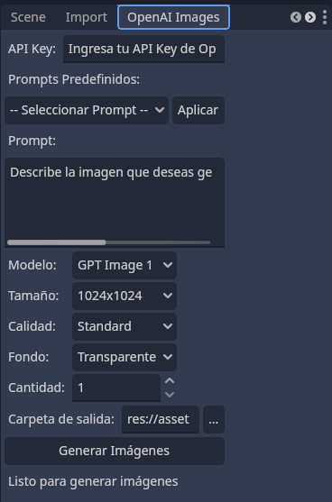

# OpenAI Image Generator Plugin

Este plugin permite generar imágenes en masa utilizando la API de OpenAI directamente desde el editor de Godot.

## Vista Previa


*Demostración del plugin en acción mostrando la generación de imágenes*

## Características

- ✨ Generación de imágenes usando la API de OpenAI
- 🎨 Soporte para diferentes modelos y tamaños
- 📁 Organización automática de imágenes generadas
- 🔄 Generación en lotes (hasta 10 imágenes por vez)
- 🎯 Interfaz integrada en el dock del editor
- 🖼️ Soporte para fondos transparentes
- 📊 Barra de progreso para seguimiento

## Instalación

1. Copia la carpeta `openai_image_generator` en el directorio `addons/` de tu proyecto
2. Ve a `Proyecto > Configuración del Proyecto > Plugins`
3. Busca "OpenAI Image Generator" y actívalo
4. El dock aparecerá en el panel izquierdo del editor

## Configuración

### API Key de OpenAI

1. Ve a [OpenAI Platform](https://platform.openai.com/api-keys)
2. Crea una nueva API key
3. Copia la key y pégala en el campo "API Key" del plugin

**⚠️ Importante:** Nunca compartas tu API key públicamente. Considera usar variables de entorno para proyectos en producción.

## Uso

### Interfaz del Plugin



*Interfaz del plugin mostrando las opciones de generación de imágenes y la nueva funcionalidad de generación en lotes*

### Pasos básicos:

1. **Configura tu API Key** en el campo correspondiente
2. **Escribe un prompt** descriptivo de la imagen que deseas generar
3. **Selecciona las opciones** según tus necesidades:
   - **Modelo**: Actualmente soporta GPT Image 1
   - **Tamaño**: 1024x1024, 1024x1792, o 1792x1024
   - **Calidad**: HD o Medium
   - **Fondo**: Transparente o Color
   - **Cantidad**: Número de imágenes a generar (1-10)
4. **Elige la carpeta de salida** donde se guardarán las imágenes
5. **Presiona "Generar Imágenes"**

### Ejemplo de prompt efectivo:

```
Side orthographic view of an orange traffic cone, in a hand-painted cartoon style, rendered in 3D with V-Ray lighting. Stylized, with smooth edges, soft shadows, and vibrant colors. Transparent background, optimized for 2D platformer video game.
```

## Opciones de configuración

### Modelos disponibles:
- **GPT Image 1**: Modelo principal de generación de imágenes

### Tamaños soportados:
- **1024x1024**: Cuadrado, ideal para iconos y sprites
- **1024x1792**: Vertical, perfecto para personajes
- **1792x1024**: Horizontal, ideal para fondos

### Calidades:
- **HD**: Mayor calidad, mayor costo
- **Medium**: Calidad estándar, menor costo

### Tipos de fondo:
- **Transparente**: Ideal para sprites y elementos de juego
- **Color**: Fondo sólido generado automáticamente

## Estructura de archivos generados

Las imágenes se guardan con el siguiente formato:
```
image_[número]_[timestamp].png
```

Ejemplo:
```
image_1_1703123456.png
image_2_1703123467.png
```

## Consejos para mejores resultados

### Prompts efectivos:
- Sé específico sobre el estilo artístico
- Menciona la perspectiva deseada (frontal, lateral, isométrica)
- Incluye detalles sobre iluminación y colores
- Especifica si es para videojuegos
- Menciona el fondo deseado

### Ejemplos de prompts:

**Para sprites de personajes:**
```
Front view of a medieval knight character, pixel art style, 32x32 resolution, transparent background, suitable for 2D RPG game
```

**Para elementos de entorno:**
```
Isometric view of a wooden treasure chest, cartoon style, bright colors, soft shadows, transparent background, game asset
```

**Para fondos:**
```
Horizontal parallax background of a mystical forest, 2D side-scrolling game style, multiple layers, atmospheric lighting
```

## Limitaciones y consideraciones

- **Costo**: Cada imagen generada consume créditos de tu cuenta de OpenAI
- **Tiempo**: La generación puede tomar varios segundos por imagen
- **Calidad**: Los resultados pueden variar según el prompt
- **Límites de API**: Respeta los límites de rate limiting de OpenAI

## Solución de problemas

### Error: "API Key no proporcionada"
- Verifica que hayas ingresado tu API key correctamente
- Asegúrate de que la key no tenga espacios adicionales

### Error: "Prompt no proporcionado"
- Escribe una descripción de la imagen que deseas generar

### Error de API (401)
- Tu API key es inválida o ha expirado
- Verifica tu cuenta de OpenAI y genera una nueva key

### Error de API (429)
- Has excedido el límite de requests
- Espera unos minutos antes de intentar nuevamente

### Error de API (500)
- Error interno del servidor de OpenAI
- Intenta nuevamente más tarde

### Las imágenes no aparecen en el FileSystem
- El plugin actualiza automáticamente el sistema de archivos
- Si no aparecen, ve a FileSystem > Reimportar

## Desarrollo y contribuciones

Este plugin está desarrollado en GDScript y es de código abierto. Las contribuciones son bienvenidas.

### Estructura del código:
- `plugin.cfg`: Configuración del plugin
- `plugin.gd`: Punto de entrada del plugin
- `image_generator_dock.gd`: Lógica principal e interfaz
- `icon.svg`: Icono del plugin

## Licencia

Este plugin se distribuye bajo licencia MIT. Consulta el archivo LICENSE para más detalles.

## Soporte

Para reportar bugs o solicitar características:
1. Abre un issue en el repositorio del proyecto
2. Incluye detalles sobre tu versión de Godot
3. Proporciona pasos para reproducir el problema

---

**Nota**: Este plugin requiere una conexión a internet activa y una cuenta válida de OpenAI con créditos disponibles.